# Wiki claude-code-from-scratch — un socle, 23 mécanismes

> **Objectif** : comprendre en profondeur le repo `inspiration/claude-code-from-scratch/`
> (Fareed Khan, « Building Claude Code Using Harness Engineering ») — le socle `core.py`
> et chacune des 23 sessions — avant de concevoir **notre propre agent harness**.

Ce repo est construit *par-dessus* learn-claude-code, mais avec une architecture inversée :
**le code n'est pas cumulatif**. Tout le code partagé (client, outils, dispatch, permissions,
boucle streaming) vit dans [[core-py]] ; chaque session est une démo autonome de 100 à 470
lignes qui l'importe et ajoute **un seul mécanisme**. C'est exactement la structure de notre
`src/` (un `shared.py` + des deltas) — d'où son intérêt comme deuxième source d'inspiration.

Les quatre principes du repo (README) : le modèle est la seule source de décisions ; les
outils sont la seule interface avec le monde ; le contexte est une ressource gérée ; les
permissions sont déclaratives, pas procédurales.

## Comment lire ce wiki

- **Dans l'ordre** (s01 → s23) si tu découvres : la progression suit les 6 phases du README.
- **Par phase** si tu cherches un mécanisme précis (voir ci-dessous).
- Commence par [[core-py]] : toutes les sessions s'y branchent.
- Chaque page suit le même plan : rôle dans le harness → vue d'ensemble du fichier →
  **chaque fonction expliquée avec ses lignes exactes** → ce qui vient de core.py → pièges.
- La section **Pièges et détails** de chaque page recense aussi les **vrais bugs du code
  source** découverts pendant la rédaction (il y en a — c'est un repo pédagogique ;
  voir notamment s18/s20 dupliqués octet pour octet, le chemin de config des permissions
  qui pointe hors du repo, ou le dispatch fantôme de s22).

## La carte

```mermaid
flowchart LR
    CORE[core.py]
    subgraph P1["🔵 Boucle d'agent"]
        s01[s01 boucle] --> s02[s02 tools] --> s03[s03 todos] --> s04[s04 subagent]
    end
    subgraph P2["🟢 Connaissance & contexte"]
        s05[s05 skills] --> s06[s06 compaction] --> s07[s07 tâches]
    end
    subgraph P3["🔴 Async & multi-agents"]
        s08[s08 background] --> s09[s09 teams] --> s10[s10 protocoles] --> s11[s11 autonomes] --> s12[s12 worktrees]
    end
    subgraph P4["🟡 Durcissement production"]
        s13[s13 streaming] --> s14[s14 outils] --> s15[s15 permissions] --> s16[s16 event bus] --> s17[s17 sessions]
    end
    subgraph P5["🟣 Runtime async"]
        s18[s18 parallèle] --> s19[s19 interrupts] --> s20[s20 cache] --> s21[s21 MCP]
    end
    subgraph P6["🩷 Entreprise"]
        s22[s22 Redis] --> s23[s23 worktrees++]
    end
    CORE -.-> P1
    s04 --> s05
    s07 --> s08
    s12 --> s13
    s17 --> s18
    s21 --> s22
```

## Le socle

| Page | En une ligne |
|---|---|
| [[core-py]] | Client Anthropic, arsenal d'outils sync/async, dispatch, permissions YAML, `stream_loop` — tout ce que les 23 sessions importent (626 lignes) |

## Les 23 sessions

### 🔵 Boucle d'agent (s01–s04)
| Session | En une ligne |
|---|---|
| [[s01-perception-action-loop]] | Le `while True` perception → action, primitif de tout le repo (149 lignes) |
| [[s02-tool-use]] | Six outils branchés sur `stream_loop` via la table de dispatch (96 lignes) |
| [[s03-todo-write]] | Plan JSON persistant imposé par le prompt : Think → Plan → Act (241 lignes) |
| [[s04-subagent]] | `spawn_subagent` : une boucle d'agent isolée dans un handler d'outil (190 lignes) |

### 🟢 Connaissance & contexte (s05–s07)
| Session | En une ligne |
|---|---|
| [[s05-skill-loading]] | Index léger dans le prompt + `load_skill` : savoir injecté à la demande (234 lignes) |
| [[s06-context-compact]] | Résumé LLM + mémoire disque quand le contexte déborde (252 lignes) |
| [[s07-task-system]] | Graphe de tâches persistant avec dépendances, en JSON (313 lignes) |

### 🔴 Async & multi-agents (s08–s12)
| Session | En une ligne |
|---|---|
| [[s08-background-tasks]] | Threads daemon + file de notifications injectées au tour suivant (236 lignes) |
| [[s09-agent-teams]] | Équipiers persistants en threads, mailboxes JSONL (317 lignes) |
| [[s10-team-protocols]] | FSM à 4 états et verrous pour formaliser le dialogue d'équipe (316 lignes) |
| [[s11-autonomous-agents]] | Workers autonomes : claim atomique sur un board JSON partagé (355 lignes) |
| [[s12-worktree-task-isolation]] | Un worktree git jetable par tâche parallèle (276 lignes) |

### 🟡 Durcissement production (s13–s17)
| Session | En une ligne |
|---|---|
| [[s13-streaming]] | Streaming token par token via `client.messages.stream()` (140 lignes) |
| [[s14-tools-extended]] | Arsenal complet d'outils, snapshots de fichiers et `revert` (110 lignes) |
| [[s15-permissions]] | Dispatch gardé par règles YAML deny/allow/ask (169 lignes) |
| [[s16-event-bus]] | Bus pub/sub : 6 événements de cycle de vie, hooks et veto (301 lignes) |
| [[s17-session-management]] | Sessions persistées en JSON : `:resume`, `:fork`, auto-save (301 lignes) |

### 🟣 Runtime async (s18–s21)
| Session | En une ligne |
|---|---|
| [[s18-parallel-tools]] | `asyncio.gather` exécute tous les `tool_use` d'un tour ensemble (266 lignes) |
| [[s19-interrupts]] | Ctrl+C devient un message `[INTERRUPT]` via une `asyncio.Queue` (239 lignes) |
| [[s20-cache-optimization]] | Marqueurs `cache_control` : préfixe caché, HIT/MISS chiffrés (266 lignes) |
| [[s21-mcp-runtime]] | Serveurs MCP stdio découverts et routés `mcp__srv__tool` (344 lignes) |

### 🩷 Entreprise (s22–s23)
| Session | En une ligne |
|---|---|
| [[s22-production-mailbox]] | Redis pub/sub remplace les mailboxes JSONL de s09 (370 lignes) |
| [[s23-worktree-advanced]] | Cycle de vie complet des worktrees : conflits, nettoyage garanti (467 lignes) |

## Liens transversaux clés

- Planification → exécution : [[s03-todo-write]] → [[s07-task-system]] → [[s11-autonomous-agents]]
- Isolation : [[s04-subagent]] (contexte) → [[s12-worktree-task-isolation]] → [[s23-worktree-advanced]] (fichiers)
- Communication d'équipe : [[s09-agent-teams]] → [[s10-team-protocols]] → [[s22-production-mailbox]]
- Le temps réel : [[s13-streaming]] ↔ [[s19-interrupts]] ↔ [[s18-parallel-tools]]
- Gouvernance : [[s15-permissions]] → [[s16-event-bus]] (hooks avec veto) → [[s21-mcp-runtime]] (outils externes gardés)
- Économie de tokens : [[s06-context-compact]] ↔ [[s20-cache-optimization]]

---

*Wiki généré le 2026-06-11 à partir du commit `fb9709e` de claude-code-from-scratch
(FareedKhan-dev). Compatible Obsidian (ouvrir `mekicode/.understand-anything/wiki-ccfs/` comme
vault) et navigable dans le navigateur via le viewer (`.understand-anything/wiki-viewer/`).*
