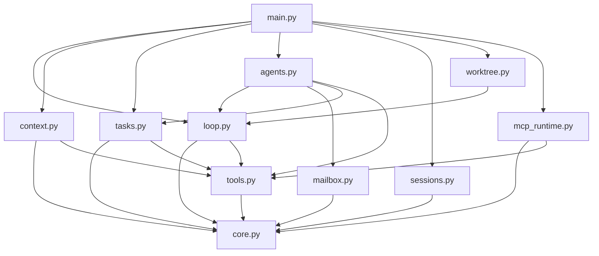

# Wiki src_scratch — le harness complet en 12 fichiers

> **Objectif** : documenter NOTRE refonte de `inspiration/claude-code-from-scratch/`
> (un socle + 23 sessions, 6 574 lignes) en une bibliothèque dédupliquée :
> **11 modules Python (2 033 lignes) + 1 config.yaml**, zéro perte de feature,
> et les bugs du repo source corrigés (marqueurs `# FIX(mekicode):`).

Là où le repo source répète la même boucle dans 23 fichiers de démo, `src_scratch/`
n'a **qu'une seule boucle** ([[loop-py]]) qui cumule streaming, permissions, hooks,
exécution parallèle, interruptions et prompt caching — et un seul point d'entrée,
[[main-py]], où toutes les features sont actives en même temps.

## Comment lire ce wiki

- Commence par [[core-py]] (le socle) puis [[loop-py]] (le cœur battant).
- Chaque page suit le même plan : rôle → vue d'ensemble → **chaque fonction avec ses
  lignes exactes** → bugs de la source corrigés ici → qui l'utilise → pièges.
- La colonne « Sessions source couvertes » dit où chaque mécanisme du repo
  d'origine a atterri (wiki jumeau : projet « claude-code-from-scratch » du viewer).

## La carte des imports



## Les modules

### 🔵 Fondations
| Module | En une ligne |
|---|---|
| [[core-py]] | Client, config.yaml (permissions 3 tiers + MCP), event bus à veto, couleurs, utilitaires partagés (158 lignes) |
| [[tools-py]] | Les 6 outils sync/async, registre dynamique `register_tool`, bash en arrière-plan (252 lignes) |
| [[loop-py]] | LA boucle : streaming, gardes hooks+permissions, `asyncio.gather`, cache, Ctrl+C (242 lignes) |

### 🟢 Contexte & tâches
| Module | En une ligne |
|---|---|
| [[context-py]] | Skills à la demande, compaction LLM au seuil, mémoire persistante datée (159 lignes) |
| [[tasks-py]] | Todos, graphe de tâches à dépendances et priorités, board atomique des workers (221 lignes) |

### 🔴 Multi-agents
| Module | En une ligne |
|---|---|
| [[mailbox-py]] | Une interface, trois backends : JSONL, Queue mémoire, Redis pub/sub (170 lignes) |
| [[agents-py]] | Subagent éphémère, équipe persistante FSM, workers autonomes (212 lignes) |

### 🟣 Intégration
| Module | En une ligne |
|---|---|
| [[worktree-py]] | Un worktree git jetable par tâche, cycle de vie complet, détection de conflits (172 lignes) |
| [[sessions-py]] | Save / resume / fork des conversations en JSON lisible (120 lignes) |
| [[mcp-runtime-py]] | Serveurs MCP stdio découverts et fermés proprement (AsyncExitStack) (146 lignes) |
| [[main-py]] | Le REPL : 16 commandes `:`, 4 flags CLI, tout branché (181 lignes) |

## Correspondance avec le repo source (non-régression)

| Sessions source | Feature | Module |
|---|---|---|
| s01, s13, s18, s19, s20 | boucle, streaming, parallèle, interrupts, cache | [[loop-py]] |
| s02, s08, s14 | dispatch, background, outils étendus + revert | [[tools-py]] |
| s15, s16 | permissions YAML, event bus + hooks | [[core-py]] + [[loop-py]] |
| s03, s07, s11 (board) | todos, graphe de tâches, claim atomique | [[tasks-py]] |
| s05, s06 | skills, compaction + mémoire | [[context-py]] |
| s04, s09, s10, s11 (workers) | subagent, équipe, FSM, autonomes | [[agents-py]] |
| s09, s22 | mailboxes JSONL / Queue / Redis | [[mailbox-py]] |
| s12, s23 | worktrees (cycle complet) | [[worktree-py]] |
| s17 | sessions resume/fork + REPL | [[sessions-py]] + [[main-py]] |
| s21 | runtime MCP | [[mcp-runtime-py]] |

## Lancer

```bash
cd src_scratch
cp ../.env.example .env   # ANTHROPIC_API_KEY + MODEL_ID
python main.py            # REPL complet — :help pour les commandes
python main.py --seq --no-cache --mcp --backend redis   # variantes
```

Vérification hors-ligne sans clé API : `python .refactor-tmp/smoke_all.py`
depuis la racine (57 contrôles : registre, permissions, hooks, dispatch,
tâches, mailboxes, sessions, worktrees réels, MCP).

---

*Wiki du code `src_scratch/` (2026-06-11). Compatible Obsidian (ouvrir
`mekicode/.understand-anything/wiki-src-scratch/` comme vault) et navigable via le viewer
(`node .understand-anything/wiki-viewer/server.mjs 8088`).*
