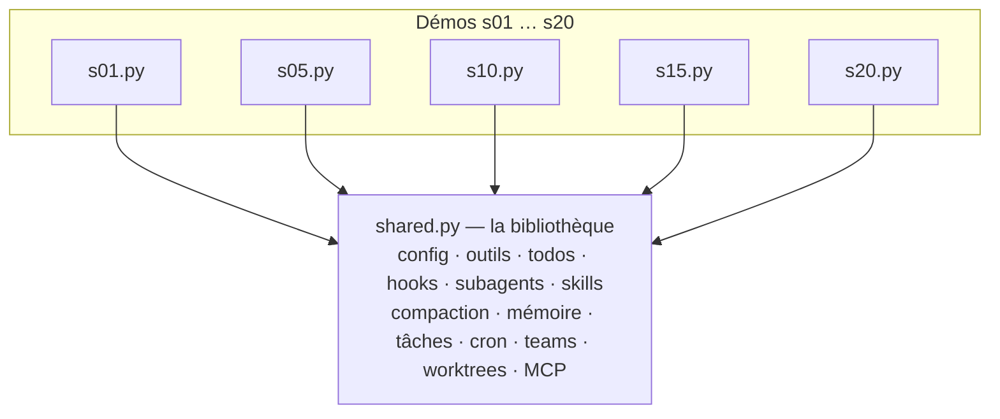

# Wiki src/ — notre agent harness

> **Objectif** : documenter NOTRE code. `src/` est la première itération de l'agent harness
> mekicode : le code commun des 20 sessions de learn-claude-code, **dédupliqué** dans
> [[shared-py]], et 20 démos fines (`s01.py` à `s20.py`) qui montrent chacune un mécanisme.

## L'architecture en deux phrases

Dans le repo d'origine, chaque session est un fichier autonome qui **recopie** tout le code
des sessions précédentes et ajoute un mécanisme. Ici on inverse : tout le code partagé vit dans
[[shared-py]] (la bibliothèque), et chaque `sNN.py` ne contient plus que **son délta** — le
câblage du sous-ensemble d'outils de sa leçon et sa démo exécutable.



## Les pages

### 📦 Bibliothèque
| Page | En une ligne |
|---|---|
| [[shared-py]] | Toute l'infrastructure réutilisable du harness, en sections |
| [[complete-py]] | **Le point d'entrée** : toutes les features actives en même temps |

### 🔵 Fondamentaux
| Page | Démo |
|---|---|
| [[s01-agent-loop]] | La boucle while + stop_reason minimale |
| [[s02-tool-use]] | Dispatch d'outils typés |
| [[s03-permission]] | Barrières de permission |
| [[s04-hooks]] | Hooks de cycle de vie |
| [[s05-todo-write]] | Planification par todos |
| [[s06-subagent]] | Délégation en contexte isolé |
| [[s07-skill-loading]] | Skills à la demande |

### 🟢 Contexte & mémoire
| Page | Démo |
|---|---|
| [[s08-context-compact]] | Compaction du contexte |
| [[s09-memory]] | Mémoire persistante |
| [[s10-system-prompt]] | Assemblage du system prompt |
| [[s11-error-recovery]] | Retry et récupération d'erreurs |

### 🟡 Tâches & temps
| Page | Démo |
|---|---|
| [[s12-task-system]] | Système de tâches fichiers |
| [[s13-background-tasks]] | Exécution en arrière-plan |
| [[s14-cron-scheduler]] | Planification cron |

### 🔴 Multi-agents
| Page | Démo |
|---|---|
| [[s15-agent-teams]] | Équipes et mailboxes |
| [[s16-team-protocols]] | Protocoles à états |
| [[s17-autonomous-agents]] | Auto-assignation de tâches |

### 🟣 Intégration & synthèse
| Page | Démo |
|---|---|
| [[s18-worktree-isolation]] | Isolation git worktree |
| [[s19-mcp-plugin]] | Outils dynamiques MCP |
| [[s20-comprehensive]] | Le harness complet assemblé |

## Lancer

```bash
pip install -r requirements.txt
cp .env.example .env          # puis renseigner ANTHROPIC_API_KEY
python src/complete.py        # le harness complet (toutes features)
python src/sessions/s01.py    # ou une démo : un mécanisme à la fois
```

## Maintenir ce wiki

Après toute modification de `src/`, lancer la skill **`/wiki-update`** : elle réécrit les pages
affectées, recale les numéros de lignes et met à jour `_manifest.json`/`_graph.json`
(règle inscrite dans `CLAUDE.md`).

---

*Wiki du projet mekicode — généré le 2026-06-11. L'autre projet du sélecteur (en haut de la
barre latérale) documente le repo d'inspiration learn-claude-code.*
