# Wiki learn-claude-code — les 20 composants du harness

> **Objectif** : comprendre en profondeur chacune des 20 sessions de
> `inspiration/learn-claude-code/` — chaque partie, chaque fonction, les lignes qui comptent —
> avant de concevoir **notre propre agent harness**.

Chaque session est un fichier Python autonome (`sNN_xxx/code.py`) qui reprend la session
précédente et ajoute **un seul mécanisme**. La devise du repo : *« The model is the driver.
The harness is the vehicle. »* — le modèle décide, le harness exécute.

## Comment lire ce wiki

- **Dans l'ordre** (s01 → s20) si tu découvres : c'est une progression pédagogique stricte.
- **Par phase** si tu cherches un mécanisme précis (voir ci-dessous).
- Chaque page suit le même plan : rôle dans le harness → vue d'ensemble du fichier →
  **chaque fonction expliquée avec ses lignes exactes** → ce qui change vs la session
  précédente → pièges.
- La section **Pièges et détails** de chaque page recense aussi les **vrais bugs du code
  source** découverts pendant la rédaction (il y en a — c'est un repo pédagogique).

## La carte

```mermaid
flowchart LR
    subgraph F["🔵 Fondamentaux"]
        s01[s01 boucle] --> s02[s02 tools] --> s03[s03 permissions] --> s04[s04 hooks] --> s05[s05 todos] --> s06[s06 subagent] --> s07[s07 skills]
    end
    subgraph C["🟢 Contexte & mémoire"]
        s08[s08 compaction] --> s09[s09 mémoire] --> s10[s10 system prompt] --> s11[s11 erreurs]
    end
    subgraph T["🟡 Tâches & temps"]
        s12[s12 tâches] --> s13[s13 background] --> s14[s14 cron]
    end
    subgraph M["🔴 Multi-agents"]
        s15[s15 teams] --> s16[s16 protocoles] --> s17[s17 autonomes]
    end
    subgraph I["🟣 Intégration & synthèse"]
        s18[s18 worktrees] --> s19[s19 MCP] --> s20[s20 capstone]
    end
    s07 --> s08
    s11 --> s12
    s14 --> s15
    s17 --> s18
```

## Les 20 sessions

### 🔵 Fondamentaux (s01–s07)
| Session | En une ligne |
|---|---|
| [[s01-agent-loop]] | La boucle `while` + `stop_reason` — le cœur de tout harness (138 lignes) |
| [[s02-tool-use]] | La dispatch table : le modèle appelle des outils typés (191 lignes) |
| [[s03-permission]] | Trois barrières déclaratives : deny list, confirmation, workspace (252 lignes) |
| [[s04-hooks]] | Hooks de cycle de vie PreToolUse/PostToolUse — observer et bloquer (294 lignes) |
| [[s05-todo-write]] | `todo_write` : planifier avant d'agir, avec rappel automatique (305 lignes) |
| [[s06-subagent]] | `spawn_subagent` : déléguer dans un contexte frais et isolé (384 lignes) |
| [[s07-skill-loading]] | SKILL.md : catalogue dans le system prompt, contenu à la demande (427 lignes) |

### 🟢 Contexte & mémoire (s08–s11)
| Session | En une ligne |
|---|---|
| [[s08-context-compact]] | Compaction L1–L4 : budget, snip, micro-compact, auto-compact (525 lignes) |
| [[s09-memory]] | MEMORY.md : la mémoire qui survit aux sessions (656 lignes) |
| [[s10-system-prompt]] | Le system prompt assemblé par sections, avec cache (219 lignes) |
| [[s11-error-recovery]] | L'oignon de retry : rate limits, overflow, erreurs réseau (366 lignes) |

### 🟡 Tâches & temps (s12–s14)
| Session | En une ligne |
|---|---|
| [[s12-task-system]] | Tâches fichiers JSON : create/claim/complete + dépendances (377 lignes) |
| [[s13-background-tasks]] | Bash en arrière-plan + notifications au tour suivant (479 lignes) |
| [[s14-cron-scheduler]] | Scheduler cron : jobs durables, queue, exécution proactive (805 lignes) |

### 🔴 Multi-agents (s15–s17)
| Session | En une ligne |
|---|---|
| [[s15-agent-teams]] | Teammates en threads + mailboxes JSONL (929 lignes) |
| [[s16-team-protocols]] | Protocole d'équipe en machine à états : REQUEST→ACK→DONE (881 lignes) |
| [[s17-autonomous-agents]] | Auto-assignation : cycle WORK → IDLE → SHUTDOWN (813 lignes) |

### 🟣 Intégration & synthèse (s18–s20)
| Session | En une ligne |
|---|---|
| [[s18-worktree-isolation]] | Un worktree git par tâche : paralléliser sans conflit (997 lignes) |
| [[s19-mcp-plugin]] | Client MCP : pool d'outils dynamique via JSON-RPC (1025 lignes) |
| [[s20-comprehensive]] | **Le capstone** : les 19 mécanismes assemblés (2124 lignes) |

## Liens transversaux clés

- Planification → exécution : [[s05-todo-write]] → [[s12-task-system]] → [[s17-autonomous-agents]]
- Isolation : [[s06-subagent]] (contexte) → [[s18-worktree-isolation]] (système de fichiers)
- Extensibilité : [[s07-skill-loading]] (connaissance) → [[s19-mcp-plugin]] (outils)
- Robustesse : [[s08-context-compact]] ↔ [[s11-error-recovery]]
- Le temps : [[s13-background-tasks]] → [[s14-cron-scheduler]]

---

*Wiki généré le 2026-06-11 à partir du commit `20e7cbb` de learn-claude-code (shareAI-lab).
Compatible Obsidian (ouvrir `mekicode/wiki/` comme vault) et navigable dans le navigateur
via le viewer (`wiki-viewer/`).*
